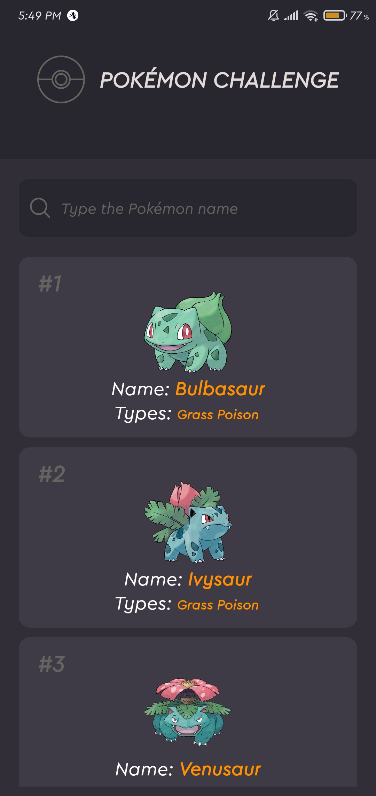
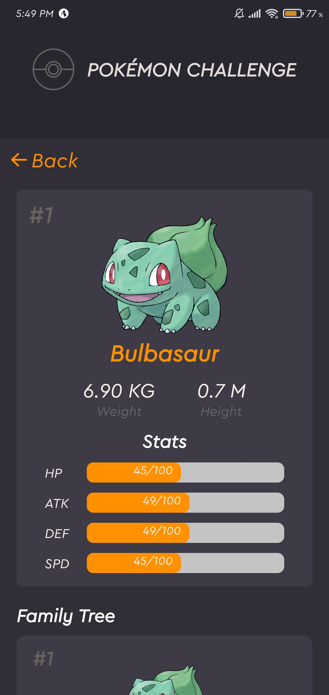
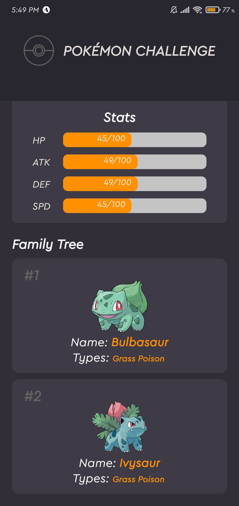

<div align="center">
<h1>Pokéedex Challenge</h1>
</img>
</div>

## 🚀 Tecnologias Usadas

- React Native
- Expo
- UseContext Api

## 💻 Como iniciar o projeto

**Clone o projeto e entre na pasta**

```bash
$ git clone https://github.com/gustavo867/pokedex-challenge && cd pokedex-challenge
```

**Siga os passos abaixo**

```bash
# Instale as dependencias
$ yarn or npm

# Se você for usar o emulador do android rode esse comando
$ yarn android

# Se for emulador ios rode sse comando
$ yarn ios

# Se for usar o celular rode esse comando
$ yarn start or expo start
```

<div align="center">
    </img>
    </img>
</div>

## 🤔 Oque achei do desafio

**Achei um desafio bem interessante pois usa a api do Pokemon que ja usei uma vez em um projeto pessoal, usei a Context Api para gerenciar o pokémon que o usuário escolheu, e isso ajudou muito na perfomance e compartilhamento de dados entre rotas, no momento so renderiza 20 pokémons, mas irei implementar um scroll infinito para melhorar a experiência**

## 🤔 Como contribuir

**Faça um fork do repositório**

```bash
# De fork usando o proprio comando oficial do Github

$ gh repo fork gustavo867/pokedex-challenge
```

**Siga os passos baixo**

```bash
# Clone seu fork
$ git clone https://github.com/gustavo867/pokedex-challenge && cd pokedex-challenge

# Create uma branch com a sua feature
$ git checkout -b my-feature

# Faça o commit com as suas mudanças
$ git commit -m 'feat: My new feature'

# Envie o código para a sua branch
$ git push origin my-feature
```

Após o seu pull request estiver sido aceito, você pode deletar a sua branch

Feito com amor 💜 por Gustavo Santana 👋 [Veja meu linkedin](https://www.linkedin.com/in/gustavo-santana-83ba611a6/)
